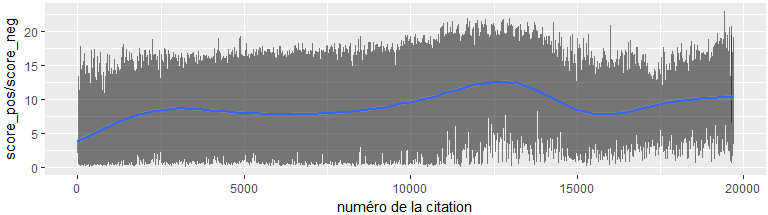
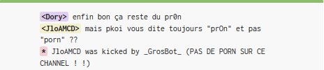

## DansTonChat, kézako?

DansTonChat est un site qui fonctionne un peu comme "Vie de Merde", sauf qu'il recense les meilleures citations et échanges les plus drôles qui ont eu lieu sur des forums de discussion (chats).

https://danstonchat.com/

Très réputé chez les ados, ce site est doublé d'une application smartphone. Pour donner une idée de la popularité, il est classé 2900^ème site français le plus consulté par l'outil Alexa Ranking ([source](https://www.alexa.com/siteinfo/danstonchat.com)), a titre de comparaison le site de l'[Elysée](http://www.elysee.fr/) est 3 fois moins fréquenté (8500^ème). Bref.

Les citations ou "quotes" sont soumises par les utilisateurs puis sélectionnées. Un système de likes/dislikes et de commentaires permet d'interagir. Le site recense (au 1er mai 2018) 19 327 quotes, une taille qui en fait un **corpus de texte** particulièrement intéressant à la fois sur le language utilisé sur ces forums, les facteurs qui font le succès d'une citation ou anecdote, et plus généralement sur la culture "geek". La population concernée a probablement entre 12 et 30 ans, est assez connectée à l'informatique et aux jeux vidéos (mais pas nécessairement, la preuve j'ai une [quote perso](https://danstonchat.com/13296.html) qui y est publiée :-)), enfin le sujet des relations amoureuses y revient souvent. 

Ma demande d'accès à la base de donnée n'ayant pas eu de réponse, j'ai décidé de passer par du **webscrapping**. Pour des raisons légales donc, je ne publie pas cette base de données qui ne m'appartient pas, mais uniquement des analyses statistiques réalisées sur ce site en accès libre.

## Webscrapping

Toute la partie webscrapping et construction de la base est réalisé sous Python 3.0 à l'aide du package BeautifulSoup (très pratique pour scrapper). L'enjeu de cette méthode est de trouver les tags HTML où sont stockées les information qui nous intéressent, ici la quote, les likes, les commentaires, etc. Premier problème, chaque ligne de la quote contient le pseudo de la personne qui écrit, et pas de aisé de le retirer... On peut faire appel à du "regex" (expressions régulières) pour créer des patterns de caractères qui vont "matcher" le pseudo. Ainsi quand j'exécute:

`findall("(?<=^<)[\S]+(?=>)", quote)`

Il ne s'agit pas de rechercher un *juron du capitaine Haddock*, mais bien un code très subtil pour faire comprendre à la fonction qu'on cherche à isoler le premier (`^`) bloc de texte de la ligne ne contenant aucun espace (`[\S]+`), et qu'on veut récupérer tout ce qui est situé entre un `<` et un `>`. Exemple:

Pour plus d'infos sur ces techniques de regex, voir [ici](https://docs.python.org/2/library/re.html). Parfois les pseudos ne sont pas isolés par des caractères spéciaux, on ne peut pas deviner..

## Aperçus...

Avant d'entrer dans des analyses compliquées, quelques exemples amusants. D'abord, la quote avec le plus de likes:

Mais aussi:

[La quote la moins likée](https://danstonchat.com/11364.html) (qui est pas si mal en fait!)

[La quote avec le plus de commentaires](https://danstonchat.com/19524.html)

[La quote avec le plus d'interlocuteurs](https://danstonchat.com/18250.html)

[La quote la plus longue](https://danstonchat.com/17812.html)

Pour revenir aw webscrapping, une particularité est l'absence totale d'horodatage des quotes. On peut retrouver manuellement les dates de certaines quotes via le compte tweeter DTC, mais impossible de remonter au delà de 2500 tweets (limite max). Bref, on sera embêté pour estimer l'effet de trend temporel sur le taux de like ou autre, il faudra faire l'hypothèse d'un rythme de publication constant, ce qui est faux. Enfin, des problèmes d'encodage de caractères spéciaux qui m'ont obligé à supprimer tous les accents.

## Quelques statistiques

Une variable d'intérêt immédiat est le rapport entre les likes et les dislikes, c'est d'ailleurs la variable utilisée par le site pour recenser leurs meilleurs quotes. Le graphique d'évolution dans le temps de ce ratio n'apporte toutefois pas tellemnet d'information, puisqu'il traduit surtout des modifications dans le mode de récolte des likes: ajout d'un bouton dislike vers la 13000^ème quote, ajout d'une fonctionnalité de reconnaissance des IP (pas de votes multiples dans la même journée), arrivée de l'appli smartphone (qui modifie l'audience et son comportement). Les quotes anciennes sont massivement plus cliquées que les récentes, ce qui peut traduire tout simplement une forte hausse du rythme de publication ces dernières années, ne laissant plus aux votes le temps de s'accumuler. Le second graphe est peut être plus parlant, et semble montrer un déficit de dislikes pour les quotes récentes (bleu clair).

Le nombre d'interlocuteurs dans une quote est dominé par le nombre 2 (plus de la moitié), les meilleurs scores étant atteints pour un nombre d'interlocuteurs élevé (entre 5 et 8), mais pas trop quand même. Les quotes "monologues" sont en général moins plébiscitées. Le *nombre de lignes* d'une quote n'a en revanche pas d'influence dramatique sur son succès. Le nombre de commentaires (qui n'est pas en soi une variable explicative car postérieure à la quote) est de 9 (med) ou 12 (moy) mais peut atteindre des pics à plus de 50 sur les quotes (1%) les plus "inspirantes".

**Particularités liée aux forums de discussion**
Certaines quotes contiennent des éléments typiques des forums de discussions, on les retrouve en nombre
- des messages "offline" pour indiquer un statut (comme sur Facebook)

- un mécanisme d'exclusion (le *kick*), qui peut etre automatique (insultes, pornographie, etc.) ou manuel. 

- le *quit* intervient quand la personne quitte volontairement (ou non) le chat

- le language LEET qui remplace certains caractères par d'autres pour contourner la modération, afin d'utiliser des mots interdits ou liés a la sexualité. En particulier le mot *porno* se voit remplacé par *pr0n* (une centaine de quotes, avec toujours une prime de likes (+15%) quand il apparait!)

- beaucoup d'exclamations, dont il a semblé totalement inutile de calculer un histogramme de fréquence du nombre de points d'exclamations ou d'interrogation consécutifs dans les quotes:

- Bien entendu, l'usage à foisons des smileys, dont une typologie s'imposait absolument. On a recencé la fréquence de chaque type de smiley dans les quotes (certains étant *étirés* à loisir), et bon... je pose ça là -__- Notez au passage que mettre le nez sur un smiley (tiret du 6) c'est *has-been*.

## Pas de politique...

la politique est très peu présente sur DansTonChat. Parce qu'elle est moins drôle, assurément, et parce qu'elle est moins un centre d'intérêt de l'audience. Toutefois quelques exceptions sont notables, et une recherche (incluant de potentielles fautes d'orthographe, donc en **regex**, souvenez-vous: `findall("[Hh]oll?ande?", quote)`). Alors voici un palmarès des hommes politiques ou partis les plus cités: une fixation sur Sarkozy et Le Pen, et un attrait supérieur des figures étrangères sur les françaises. A part ceux du tableau, tous les autres sont inexistants. Au total, ces termes ne représentent qu'un minuscule 0.3% des quotes.

## Analyse sémantique

Foin d'ACP ou de modèles linéaires (ca serait trop pénible à présenter ici), allons tout de suite vers quelque chose de plus fin et subtil avec la **statistique textuelle**, il faut bien rentabiliser les formations qu'on fait! Le must en la matière est le logiciel **IRAMUTEQ** développé par Pierre Ratinaud du laboratoire LERASS (Toulouse). La statistique textelle va analyser le vocabulaire utilisé, le regrouper (*lemmatisation*) et classer en formes grammaticales, les hapax (mots uniques commes les pseudos ici), les fréquences, et surtout analyser les co-occurences (proximité des mots entre les segments (=quotes)). Et histoire de bien mesurer l'ampleur des dégâts, on va comparer avec l'analyse d'un must de la littérature française: Germinal d'Emile Zola ([source](http://athena.unige.ch/athena/admin/ath_txt.html) du texte brut).

Le nombre moyen de mots par quote est de 42 (oO => étonnement). Le corpus DTC rassemble 45000 formes syntaxiques (on doit cependant retrancher 22000 pseudos différents), contre seulement 7000 chez Zola (encore une fois: o_O => étonnement voire incrédulité). L'explication est pourtant simple: sur les forums, le même mot est rarement écrit deux fois de la même façon, et IRAMUTEQ a été incapable de lemmatiser une telle diversité de language. Ce n'est pas genant puisque les analyses vont se focaliser sur les mots à plus forte occurence.

